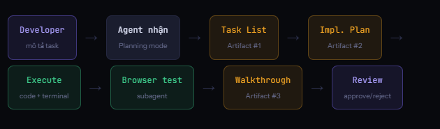

# Google Antigravity
## Kiến trúc & Developer Guide
- **Google Antigravity**: là agentic IDE thế hệ mới ra mắt tháng 11/2025 - fork từ VS Code nhưng được tái thiết kế hoàn toàn theo triết lý **agent-first**. Không còn AI là plugin phụ trợ - agent là thực thể trung tâm tự lên kế hoạch, thực thi code, kiểm thử trên browser và tạo Artifacts để bạn verify. Download: `antigravity.google/download`· CLI: `agy`

# ĐỊNH VỊ
- **Điểm mạnh cốt lõi**: **Async multi-agent** là diffenentiator lớn nhất. Thay vì chời AI xong rồi mới làm tiếp, bạn dispatch 5 agent cho 5 bugs đồng thời. Developer chuyển từ *người viết code sang* **kiến trúc sư quản lý agents**.

# KIẾN TRÚC TỔNG THỂ
**AntiGravity được tổ chức thành 5 component core phối hợp với nhau - tất cả hướng đến một mục tiêu: developer làm việc ở task level, không phỉa line level.**
- **L5** - **Customization Layer**: Rules, Workflows, Skills, GEMINI.md - developer định nghĩa behavior của agent `GEMINI.md` `.agent/rules/` `.agent/workflows/` `skills/`
- **L4** - **Agent Manager**: Mission Control - dispatch tasks, monitor agents chạy song song, review & approve Artifacts `Async tasks` `Multi-agent` `Artifacts`
- **L3** - **Editor View**: AI-powered IDE quen thuộc thuộc kế thừa VS Code - tab completion, inline commands, direct file editing
- **L2** - **Browser Subagent**: Specialized model điều khiển Chrome thực - click, scroll, type, chụp screenshot, đọc DOM, tạo recordings `Chrome Extension` `DOM capture` `Walkthrough recording`
- **L1** - **Tool Layer**: Terminal, filesystem, MCP services (Github, DB, Jira...) - agent gọi để thực thi task `Terminal` `File I/O` `MCP`

# LUỒNG THỰC THI MỘT TASK

# Agent Manager - Mission Control
**Đây là điểm khác biệt lớn nhất của AntiGravity. Thay vì chatbox tuyến tính phải chờ, Agent Manager là dashboard quản lý nhiều agents song song bất đồng bộ.**

- **Dispatch không cần chờ**: Gửi task mới ngay khi agent khác đang chạy. Mỗi task có agent instance riêng xử lý độc lập - 5 bugs xử lý đồng thời.
- **Real-time status**: Xem progress, artifacts (hiện vật) đã tạo, pending approvals (đang chờ phê duyệt), và reasoning (suy luận) của từng của từng agent - tất cả trên cùng dashboard.
- **Artifacts=bằng chứng**: Agent không chỉ nói "đã fix" - nó tạo Task List, Implementation Plan, Code Diff, Walkthrough recording để vạn verify trước khi approve.