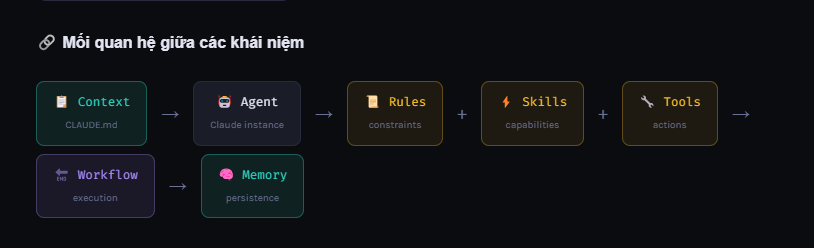

# KIẾN TRÚC DỰ ÁN

## Cấu trúc dự án tối ưu cho Claude

- Hướng dẫn thiết kế cấu trúc thư mục, định nghĩa **Rule, Skills, Tools, Agents, Worflow** và **Memory** - để Claude đọc hiểu codebase và hỗ trợ lập trình hiệu quả nhất.

## TẠI SAO CẦN CẤU TRÚC ĐẶC BIỆT?

- **Claude không "nhớ" codebase của bạn tự động**. Mỗi lần mở conversation mới là một tờ giấy trắng. Cấu trúc tốt = **giúp Claude hiểu ngữ cảnh nhanh**, code đúng conversation, không lặp lỗi cũ, và làm việc như một team member thực sự.

# KHÁI NIỆM

## Các khái niệm cốt lõi

- **Hiểu rõ 7 building block này là nền tẳng để xây dựng workflow AI hiệu quả cho dự án của bạn.**
  - **Rules** - **`QUY TẮC & RÀNG BUỘC`**: `Những điều Claude PHẢI làm hoặc KHÔNG được làm. Coding convenstions, security rules, naming partterns của dự án`.
  - **Skills** - **`NĂNG LỰC CỤ THỂ`**: `Tập hợp kiến thức và kỹ năng cho domain cụ thể. Ví dụ: skill viết JPA query, skill tạo React component theo design system`.
  - **Tools** - **`CÔNG CỤ THỰC THI`**: `Functions Claude có thể gọi để tương tác với hệ thống: đọc file, query DB, gọi API, chạy terminal commands`.
  - **Agents** - **`TÁC NHÂN TỰ ĐỘNG`**: `Claude instance chuyên trách một domain: Backend Agent, Frontend Agent, QA Agent, DevOps Agent. Mỗi agent có context và tools riêng`.
  - **Workflow** - **`QUY TRÌNH TỰ ĐỘNG HÓA`**: `Chuỗi bước tự động được định nghĩa: từ nhận yêu cầu → phân tích → implement(thực hiện) → test → review → deploy`.
  - **Memory** - **`BỘ NHỚ NGỮ CẢNH`**: `Nơi lưu trữ kiến thức quan trọng: decisions (quyết định) đã được đưa ra, bugs đã gặp, patterns đang dùng, tech debt (nợ công nghệ) cần xử lý`.
  - **Context** - **`NGỮ CẢNH DỰ ÁN`**: `CLAUDE.md - file markdown chứa mọi thuông tin Claude cần biết về dự án ngay khi mở conversation mới`.

## Mối quan hệ giữa các khái niệm



# KIẾN TRÚC

## KIẾN TRÚC HẠ TẦNG

- Một dự án AI-optimized được tổ chức theo 5 tầng rõ ràng, từ hạ tầng đến giao tiếp với Claude.
  - **L5** - **AI Interaction Layer** _(Lớp tương tác AI)_: CLAUDE.md, .currsorrules, workflows, memory files - nơi Claude đọc context `CLAUDE.md` `.cursorrules` `/ai/`
  - **L4** - **Application Layer**: Frontend (React/Next.js) + Backend (Spring Boot) - business logic và UI `frontend/` `backend/` `API contracts`
  - **L3** - **Domain Layer**: Entities, aggregates, domain events, value objects - pure bussiness logic `domain/` `entities/` `events/`
  - **L2** - **Infrastructure Layer** _(Lớp cơ sở hạ tầng)_: Database, cache, message queue, external APIs - adapters và implementation `persistence/` `messaging/` `integration/`
  - **L1** - **DevOps Layer**: Docker, K8s manifests, CI/CD pipelines, IaC (Terraform) - deployment `deploy/` `k8s/` `.gitlab-ci.yml`

# CẤU TRÚC
## Root - Cấu trúc gốc dự án
Đây là cấu trúc thư mục chuẩn cho một dự án fullstack với AI Layer được tích hợp đầy đủ. Mỗi thư mục có mục đích rõ ràng để Claude hiểu ngay.
```bash
├── 
📁 .ai/ ← AI layer: context cho Claude
│ ├── CLAUDE.md ← entry point, Claude đọc đầu tiên
│ ├── rules/ ← coding rules & constraints
│ │ ├── global.md ← rules áp dụng toàn project
│ │ ├── backend.md ← Java/Spring Boot rules
│ │ └── frontend.md ← React/TS rules
│ ├── skills/ ← kỹ năng domain-specific
│ │ ├── jpa-query.md ← cách viết JPA queries
│ │ ├── api-design.md ← REST API conventions
│ │ └── react-patterns.md ← component patterns
│ ├── tools/ ← MCP tool definitions
│ │ ├── db-tools.json ← query database tools
│ │ └── git-tools.json ← git operation tools
│ ├── agents/ ← agent definitions
│ │ ├── backend-agent.md
│ │ ├── frontend-agent.md
│ │ └── qa-agent.md
│ ├── workflows/ ← automation workflows
│ │ ├── feature-dev.md ← feature development flow
│ │ └── bug-fix.md ← bug fix flow
│ └── memory/ ← persistent knowledge
│ ├── decisions.md ← architectural decisions
│ ├── known-issues.md ← bugs & workarounds
│ └── tech-debt.md ← items cần refactor
├── 📁 backend/ ← Spring Boot microservices
├── 📁 frontend/ ← React/Next.js app
├── 📁 deploy/ ← K8s, Docker, Terraform
├── 📁 docs/ ← API specs, ADRs, diagrams
├── CLAUDE.md ← symlink → .ai/CLAUDE.md
├── 📄 .cursorrules ← rules cho Cursor IDE
└── docker-compose.yml
```
- **Nguyên tắc thiết kế thư mục**: Đặt toàn bộ AI context trong thư mục `.ai/` - dễ gitignore nếu cần, dễ share giữa team, và Claude biết đây là "nguồn sự thật" về dự án. File `CLAUDE.md` ở root là symlink để Claude tự động đọc khi mở project.

## CẤU TRÚC BACKEND TỐI ƯU - JAVA/SPRING BOOT
Cấu trúc theo **Hexagonal Architecture** (Port & Adapter) kết hợp với DDD - giúp Claude hiểu doundary rõ ràng và generate code đúng layer.
```bash
src/main/java/com/company/app/
│
├── domain/ ← Pure business logic, no framework
│ ├── model/ ← Entities, Value Objects
│ │ ├── Order.java ← Aggregate root
│ │ ├── OrderId.java ← Value Object (record)
│ │ └── Money.java ← Value Object
│ ├── event/ ← Domain events
│ │ └── OrderPlacedEvent.java
│ ├── port/ ← Interfaces (Ports)
│ │ ├── in/ ← Use case interfaces (input ports)
│ │ │ └── PlaceOrderUseCase.java
│ │ └── out/ ← Repository interfaces (output ports)
│ │ └── OrderRepository.java
│ └── service/ ← Domain services
│ └── OrderDomainService.java
│
├── application/ ← Use case implementations
│ ├── usecase/
│ │ └── PlaceOrderUseCaseImpl.java
│ └── dto/ ← Request/Response DTOs (records)
│ ├── PlaceOrderRequest.java
│ └── OrderResponse.java
│
├── adapter/ ← Framework adapters (Adapters)
│ ├── in/ ← Inbound adapters
│ │ ├── rest/ ← REST Controllers
│ │ │ ├── OrderController.java
│ │ │ └── OrderControllerAdvice.java
│ │ └── kafka/ ← Kafka consumers
│ │ └── PaymentEventConsumer.java
│ └── out/ ← Outbound adapters
│ ├── persistence/ ← JPA implementations
│ │ ├── OrderJpaRepository.java
│ │ ├── OrderRepositoryAdapter.java
│ │ └── OrderEntity.java ← @Entity (JPA)
│ └── kafka/ ← Kafka producers
│ └── OrderEventPublisher.java
│
└── config/ ← Spring configurations
 ├── SecurityConfig.java
 ├── KafkaConfig.java
 └── OpenApiConfig.java
src/main/resources/
├── application.yml
├── application-local.yml
└── db/migration/ ← Liquibase changesets
 └── V001__create_orders.sql
```
- **LÝ DO DÙNG HEXAGONAL ARCHITECTURE**: Claude hiểu rõ: `domain/` = không có Spring annotation nào, `application/` = orchestration logic, `adapter/` = framework code. Khi bạn nói "viết use case mới", Claude biết đặt file ở đầu mà không cần hỏi thêm.

## CẤU TRÚC FRONTEND TỐI ƯU - REACT/TYPESCRIPT
Feature-based structure theo **Feature-Sliced Design (FSD)** - Claude biết chính xác component nào thuộc layer nào.
```bash
rc/
│
├── app/ ← App setup, providers, routing
│ ├── App.tsx
│ ├── providers.tsx ← QueryClient, Auth, Theme
│ └── router.tsx ← React Router v7
│
├── pages/ ← Route-level components (thin shells)
│ ├── orders/
│ │ ├── OrderListPage.tsx
│ │ └── OrderDetailPage.tsx
│ └── auth/
│ └── LoginPage.tsx
│
├── features/ ← Feature modules (bounded contexts)
│ ├── orders/
│ │ ├── components/ ← Feature-specific components
│ │ │ ├── OrderCard.tsx
│ │ │ └── OrderForm.tsx
│ │ ├── hooks/
│ │ │ ├── useOrders.ts ← React Query hooks
│ │ │ └── useOrderForm.ts
│ │ ├── api/
│ │ │ └── orders.api.ts ← axios calls
│ │ ├── store/
│ │ │ └── ordersSlice.ts ← Zustand / Redux slice
│ │ └── types/
│ │ └── order.types.ts
│ └── auth/
│ ├── components/
│ ├── hooks/
│ └── AuthContext.tsx
│
├── shared/ ← Shared, reusable code
│ ├── ui/ ← Design system components
│ │ ├── Button.tsx
│ │ ├── Modal.tsx
│ │ └── DataTable.tsx
│ ├── hooks/ ← Generic hooks
│ │ ├── useDebounce.ts
│ │ └── usePagination.ts
│ ├── utils/
│ │ ├── format.ts ← date, currency, number
│ │ └── validation.ts
│ ├── api/
│ │ └── client.ts ← axios instance + interceptors
│ └── types/
│ └── global.types.ts
│
└── assets/ ← Static files
```
- **FSD IMPORT RULE CHO CLAUDE**: `pages/` chỉ được import từ `features/` và `shared/`. `features/` chỉ import từ `shared/`. Không bao giờ import ngược chiều. Khi Claude thêm import, nó tuân theo rule này nếu bạn ghi rõ trong `.ai/rules/frontend.md`

# BUILD BLOCK
## Rules - Quy tắc bắt buộc
Rule là những ràng buộc Claude phải tuân theo. Không phải gợi ý - là luật. Ghi rõ ràng, ngắn gọn, dễ kiểm tra.
- Ví dụ: `.ai/rules/backend.md`
```markdown
# Backend Rules — Spring Boot 3 / Java 21

## ❌ KHÔNG ĐƯỢC LÀM
- Không dùng field injection (@Autowired trên field) — chỉ dùng constructor injection
- Không trả về Entity trực tiếp từ Controller — phải qua DTO
- Không dùng Optional.get() không có isPresent() check
- Không dùng System.out.println() — chỉ dùng SLF4J Logger
- Không bao giờ catch(Exception e) mà không log hoặc rethrow
- Không đặt business logic trong @Entity class
- Không dùng @Transactional trên private method

## ✅ PHẢI LÀM
- Mọi method public phải có Javadoc
- DTO phải là Java records (immutable)
- Repository method phải có @Query rõ ràng, không dùng derived method nếu query phức tạp
- Service layer phải có @Transactional(readOnly = true) cho read operations
- Exception handling: throw custom exception, handle tại @ControllerAdvice
- Mọi API response phải wrap trong ApiResponse<T> generic wrapper
- Test: minimum 80% coverage cho domain và application layer

## 📏 NAMING CONVENTIONS
- Entity: PascalCase, không có suffix (Order, không phải OrderEntity)
- JPA Entity class: OrderJpaEntity (suffix JpaEntity)
- Repository interface: OrderRepository (port), OrderJpaRepository (adapter)
- Use case: PlaceOrderUseCase (interface), PlaceOrderUseCaseImpl (impl)
- DTO: PlaceOrderRequest, OrderResponse (không dùng DTO suffix)
- Constants: ALL_CAPS_SNAKE_CASE trong enum hoặc class riêng
```
- Ví dụ: `./ai/rules/frontend.md`
```markdown
# Frontend Rules — React 19 / TypeScript

## ❌ KHÔNG ĐƯỢC LÀM
- Không dùng 'any' type — luôn type explicit
- Không dùng default export cho components — chỉ named export
- Không gọi API trực tiếp trong component — phải qua custom hook
- Không dùng useEffect cho data fetching — dùng React Query
- Không mutate state trực tiếp — luôn tạo object mới
- Không import từ layer cao hơn trong FSD hierarchy

## ✅ PHẢI LÀM
- Mọi component phải có TypeScript interface cho props
- Dùng Zod cho form validation và API response validation
- Error boundary cho mỗi feature module
- Suspense + skeleton loading cho async components
- Memoization: useMemo cho expensive calculations, useCallback cho handlers
- Tên component file = tên component (OrderCard.tsx export { OrderCard })

## 🎨 STYLING
- Dùng Tailwind CSS utility classes
- Custom design tokens trong tailwind.config.ts
- Không inline style trừ dynamic values (height, width computed)
- Dark mode: dùng dark: prefix của Tailwind

## 📡 API CALLS
- Mọi request qua shared/api/client.ts (axios instance đã config)
- React Query keys: ['orders', orderId] — array format
- Error: toast notification qua react-hot-toast
- Loading: skeleton component, không dùng spinner riêng lẻ
```

## Skill - Kỹ năng chuyên biệt
Skill là `playbook` cho Claude về cách xử lý một tác vụ cụ thể. Khác với rules (cấm/cho phép), skill là **hướng dẫn chi tiết cách làm tốt nhất**.
- Ví dụ: `.ai/skills/jpa-query.md`
```markdown
# Skill: JPA Query Optimization

## Khi nào áp dụng
Khi viết Repository methods, @Query annotations, hoặc khi nhận được
yêu cầu liên quan đến database query performance.

## Nguyên tắc cốt lõi

### 1. Luôn kiểm tra N+1 risk
Nếu entity có @OneToMany hoặc @ManyToMany:
- DEFAULT: fetch = FetchType.LAZY (luôn lazy)
- Khi cần join: dùng @EntityGraph hoặc JOIN FETCH
- Không bao giờ fetch EAGER cho collection

### 2. Ưu tiên Projection cho read queries
Thay vì load toàn bộ entity, dùng DTO projection:

```java
// Thay vì:
List<Order> findByUserId(Long userId);

// Dùng:
@Query("SELECT new com.app.dto.OrderSummary(o.id, o.status, o.total) " +
       "FROM Order o WHERE o.userId = :userId")
List<OrderSummary> findSummaryByUserId(@Param("userId") Long userId);
```

### 3. Pagination bắt buộc cho list queries
Không bao giờ trả về List không giới hạn — luôn dùng Pageable:

```java
Page<OrderSummary> findByUserId(Long userId, Pageable pageable);
```

### 4. Index hints trong @Query
Với query phức tạp, comment index đang dùng:
```java
@Query(value = "/* INDEX(orders idx_user_status) */ ...")
```

## Anti-patterns cần tránh
- findAll() không có filter/pagination
- Gọi repository trong vòng lặp (N+1 pattern)
- COUNT query riêng để check tồn tại — dùng EXISTS thay thế
- JPQL với string concatenation — luôn dùng @Param
```
- Ví dụ: `.ai/skills/react-patterns.md`
```markdown

```